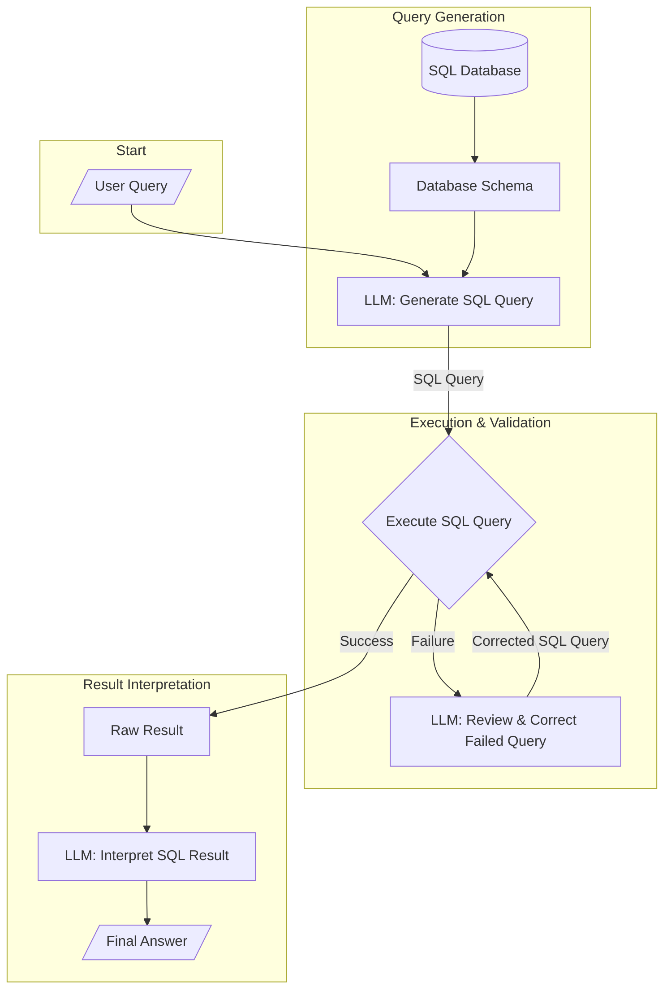

# AI SQL Agent

An intelligent agent that translates natural language questions into SQL queries, executes them against a MySQL database, and provides human-readable answers. It also includes a self-correction mechanism for SQL queries and a user-friendly Streamlit interface.



## Features

- **Natural Language to SQL Conversion**: Converts plain English questions into valid SQL queries using the Gemini 2.5 Flash model.
- **Dynamic Schema Awareness**: Automatically extracts and utilises the database schema (tables, columns, and sample data) to generate accurate SQL.
- **SQL Query Review and Correction**: If an initial SQL query fails during execution, the agent sends the query to Gemini for critical evaluation, identifying errors, inefficiencies, and suggesting a corrected version.
- **Conditional Review**: The SQL review process is only triggered when an execution error occurs, optimising API calls.
- **SQL Execution**: Executes the generated (or corrected) SQL queries against a MySQL database.
- **Natural Language Response Generation**: Formats query results into clear, conversational answers for non-technical users.
- **Streamlit Web Interface**: Provides an intuitive web dashboard for users to ask questions and view the answer, the executed SQL query and its results, and detailed SQL review information (if applicable).

## Setup and Installation

Follow these steps to get the SQL Agent up and running on your local machine.

### 1. Clone the Repository

```bash
git clone https://github.com/rj-price/sql_agent.git
cd sql_agent
```

### 2. Set Up Environment Variables

Create a `.env` file in the root directory of the project based on the `.example.env` provided. This file will store your API keys and database credentials.

```ini
# .env

# Google Gemini API Key
GOOGLE_API_KEY=your_gemini_api_key

# MySQL Database Configuration
SQL_HOST=your_mysql_host # e.g., localhost
SQL_USER=your_mysql_user
SQL_PASSWORD=your_mysql_password
SQL_DATABASE=your_mysql_database_name
SQL_PORT=3306 # Default MySQL port
```

Replace the placeholder values with your actual credentials.

### 3. Install Dependencies

The project uses `pip` for dependency management. Install all required packages using the `requirements.txt` file:

```bash
pip install -r requirements.txt
```

### 4. Database Setup

Ensure you have a MySQL database running and accessible with the credentials provided in your `.env` file. The agent will automatically infer the schema from this database.

## Usage

### Running the Streamlit Application

To start the web interface, navigate to the project root directory in your terminal and run:

```bash
streamlit run app.py
```

This will open the Streamlit application in your web browser (usually at `http://localhost:8501`).

### Interacting with the Agent

1.  **Ask a Question**: Type your natural language question about your database into the input box at the bottom of the Streamlit interface.
2.  **View Results**: The application will display the answer in the "Answer" tab.
3.  **Inspect SQL**: The "SQL Query & Results" tab will show the SQL query that was executed and the raw data returned from the database.
4.  **Review Information**: If the initial SQL query failed and was subsequently reviewed and corrected, a "Review Info" tab will appear, providing details on the review and the corrected query.

## Project Structure

- `sql_agent.py`: Contains the core logic for natural language processing, SQL generation, database interaction, and SQL query review.
- `app.py`: The Streamlit application that provides the web-based user interface.
- `requirements.txt`: Lists all Python dependencies required for the project.
- `.env`: (Not committed) Stores sensitive environment variables like API keys and database credentials.
- `.example.env`: A template for the `.env` file.